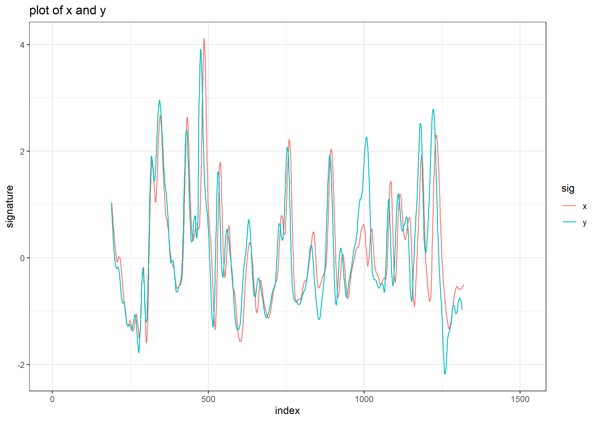

class: primary-blue
## Install

<br>  

- Since the package is not on CRAN yet, you can install the development version by:  
```{r tidy=FALSE, eval=FALSE}
install.packages("devtools")
devtools::install_github("willju-wangqian/CMPS")
```

- The website of the package: [https://willju-wangqian.github.io/CMPS/](https://willju-wangqian.github.io/CMPS/)

---
class: primary-blue
## Input

- `x`, `y` are numeric vectors
  - `x` is the vector of the reference bullet signature/profile that will be divided into basis segments
  - `y` is the vector of the comparison bullet signature/profile
  
- if we plot signatures `x` and `y`, we have
.img50[]
  - In this example, `x` and `y` are signatures of a Known Match comparison

---
class: primary-blue
## The Main Function

```{r, eval=FALSE}
library(CMPS)

cmps_result <- extract_feature_cmps(x, y)

## this comment shows default values of different arguments
## for more information, use ?extract_feature_cmps 
# extract_feature_cmps(
#   x,
#   y,
#   seg_length = 50,          
#   seg_scale_max = 3,
#   Tx = 25,
#   npeaks.set = c(5, 3, 1),
#   full_result = FALSE
# )
```

```{r, echo=FALSE}
cmps_full_result <- readRDS("ppt_object3_cmps_result.rds")
cmps_result <- cmps_full_result$CMPS.score
```

```{r}
cmps_result
```

- The output of the function (by default) is the CMPS score of this comparison

```{r, echo=FALSE, eval=FALSE}
---
class: primary-blue
## Output

- `CMPS.score`: the CMPS score of this comparison
- `nseg`: the number of basis segments obtained from the reference profile
- `rec.position`: the recommended position that results in the CMPS score
- `pos.df`: a dataframe that includes all positions and their corresponding CMPS score

## ```{r}
# cmps_full_result$CMPS.score
# cmps_full_result$nseg
# cmps_full_result$rec.position
# ```
#
# ```{r, eval=FALSE}
# cmps_full_result$pos.df
## ```
```


---
class: primary-blue
## Multi segment lengths

- multi-peak inspection
  - `seg_scale_max = 1, npeaks.set = c(5)`
  - faster in running speed

- multi-peak inspection at different segment scales
  - `seg_scale_max = 3, npeaks.set = c(5, 3, 1)`
  - detect 5 peaks at scale one; 3 peaks at scale two; 1 peak at scale three
  - default setting
  


---
class: primary-blue
## Full Comparison of Two Bullets

- The bullet examples are coming from Hamby252; the url of these bullets are stored in `bullets$source`

```{r, eval=FALSE}
library(CMPS)
data("bullets")

bullets$source
```
  
- we have two bullets, and each bullet has 6 lands (6 signatures)
- in total, we have 36 comparisons

```{r, eval=FALSE, echo=FALSE}
library(tidyverse)
library(bulletxtrctr)
library(CMPS)

data("bullets")

lands <- unique(bullets$bulletland)

comparisons <- data.frame(expand.grid(land1 = lands[1:6], land2 = lands[7:12]), 
                          stringsAsFactors = FALSE)

# Obtain the signatures
comparisons <- comparisons %>% mutate(
  aligned = purrr::map2(.x = land1, .y = land2, 
                        .f = function(xx, yy) {
                          land1 <- bullets$sigs[bullets$bulletland == xx][[1]]
                          land2 <- bullets$sigs[bullets$bulletland == yy][[1]]
                          land1$bullet <- "first-land"
                          land2$bullet <- "second-land"
                          
                          sig_align(land1$sig, land2$sig)
                        }))
```

---
class: primary-blue
## Full Comparison of Two Bullets

```{r, echo=FALSE}
cp1 <- readRDS("ppt_object2_cp1.rds")
```

```{r, eval=FALSE, echo=FALSE}
# Compute the CMPS score
comparisons.cmps <- comparisons %>%
  mutate(cmps = aligned %>% purrr::map_dbl(.f = function(a) {
    extract_feature_cmps(a$lands$sig1, a$lands$sig2, full_result = FALSE)
  }))

cp1 <- comparisons.cmps %>% select(land1, land2, cmps)
```

```{r, eval=FALSE, echo=FALSE}
head(cp1, 10)
```

- present the results in a matrix form

```{r,  echo=FALSE}
cp1.matrix <- matrix(nrow = 6, ncol = 6)

for(i in 1:6) {
  cp1.matrix[i,] <- cp1$cmps[1:6 + 6*(i-1)]
}

rownames(cp1.matrix) <- paste("1", 1:6, sep = '-')
colnames(cp1.matrix) <- paste("2", 1:6, sep = '-')

cp1.matrix <- t(cp1.matrix)
full_comparison.matrix <- cp1.matrix
```

```{r}
full_comparison.matrix
```

---
class: inverse-blue, center, middle
# Thank you

